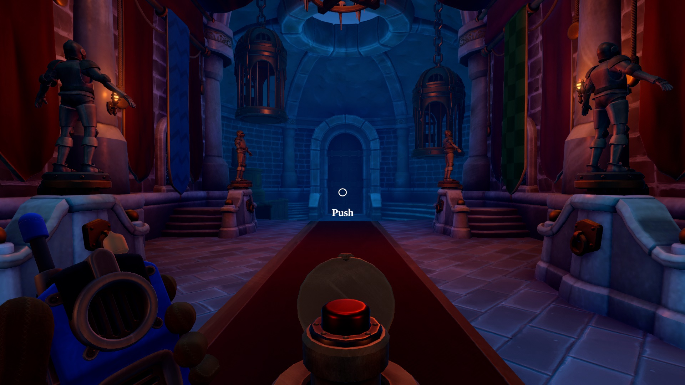

# 프로젝트명 : The Escapeers (2명의 탈출자들을 지칭하는 말입니다.)

# [ 목차 ]
### 1. [게임명](#1)
### 2. [컨셉](#2)
### 3. [관련 이미지와 동영상](#3)
### 4. [대표 이미지 그리고 컨셉과 대표이미지 기반 작품 묘사](#4)
### 5. [The Escapeers의 구성 요소](#5)
### 6. [게임 시스템 디자인](#6)
#####   [·   게임 오브젝트 분해](#10)
#####   [·   파라미터(속성)](#11)
#####   [·   행동](#12)
#####   [·   플레이어 캐릭터 속성(파라미터)](#14)
#####   [·   게임의 규칙](#15)
#####   [·   게임에서 사용될 공식](#16)

### 7. [개발 요구사항 & 흐름도](#7)
##### [·   요구사항(1년 / 6주)](#17)
##### [·   시간별 흐름도 flowchart[선택사항]](#18)
### 8. [스토리보드](#8)
### 9. [1주차 작업 결과](files/w01/index.md)
# [ 게임명 ] 
이 게임의 이름은 The Escapeers입니다.
  
# [ 컨셉 ] 

## 메인컨셉 : 협동

### 서브 컨셉 1 : 다양성
여러 다양한 퀴즈나 두명이서 협동하는 상호작용을 이용하여 스테이지 구성
  

### 서브 컨셉 2 : 개연성
탐험을 좋아하는 2명의 탐험가가 외지에 놀러 갔다가 극지에 갇히게 되는데 잠시 휴식하러 온 곳에 갇히게 되는 이야기로 마지막 스테이지인 설산을 탈출한다는 자연스러운 구성으로 만듬 
  

### 서브 컨셉 3 : 성취감
각 스테이지를 통과할때 마다 ui를 통한 성취감 달성 
  

### 서브 컨셉 4 : 현실감
1인칭 3d를 통한 시점적인 부분에 대해 플레이어가 현실감을 느끼게함
  

### 서브 컨세 5 : 멀티플레이
2인플레이가 가능하게 할려 함

  

# [관련 이미지 & 동영상] 
- 이미지  
   

  

# [대표 이미지]
- 이미지  
  

  

# [컨셉 & 대표이미지 기반 작품묘사] 

> ### 대표이미지 기반 :
- 이미지  
  
  
    
# [The Escapeers 구성 요소] 

 

## 1. 메커니즘

[도전 과제]

[재미 요소]

 

## 2. 이야기

[이야기] : 탐험을 좋아하는 2명의 탐험가가 외지에 놀러 갔다가 극지에 갇히게 되는데 잠시 휴식하러 온 곳에 갇히게 되는 이야기이다. 

[만들게 된 배경]  

평소에 게임을 즐겨 하기도 하였고 여러 게임을 접하였습니다. fps나 rts 등등 여러 장르의 게임을 해봤는데 유독 스토리 있고 몰입감 있는 게임에 흥미를 많이 느꼈습니다. 또한 혼자
하는 것이 아닌 친구랑 협동하거나 다른 플레이어와 같이 플레이 하는 것이 더 재밌다는 생각이 들었습니다. 그래서 이러한 협동 탈출 게임을 만들게 된 것 같습니다. 시중에 나와있는 방탈출 게임은 대부분 한정된 장소라 지루함이 있을 수 있습니다. 다양한 장소가 나올수 있는 스토리를 짜고 이에 맞는 장소를 구현해 플레이 하는 사람에게 끔 게임의 다양성과 흥미를 이끌어 낼 수있을 겁니다. 

[카메라 관점]  

처음에 잡았던 현실감 요소를 극대화 시키기 위해 카메라 시점의 경우는 1인칭을 사용하
기로 했습니다. 2인 게임이기 때문에 각각의 플레이어는 1인칭 플레이를 하게 됩니다.
 

## 3. 미적요소

[디자인]  

캐릭터 디자인 : 2명의 캐릭터 3D 캐릭터로 디자인
맵 디자인

동굴 스테이지 : 처음 시작하는 스테이지로 어둑어둑하면서 벽화 퀴즈나 횟불 키기와 같은 
쉬운난이도의 스테이지

집안 스테이지 : 본격적인 단계로 여러 퀴즈 (양과 늑대 옮기기 퀴즈), 아이템과 상호작용
을 통한 해결 

설산 스테이지 : 야외가 주 무대인 단계로 추위로 인한 시간제한이 있을 예정 큰 무대를 배
경으로 물건 옮기는게 주 목적

[음향]  

각 스테이지에 걸맞는 음향과 여러 문제를 해결할 때 결과를 소리로 알려줄 예정입
니다.
  

  
# [게임흐름]
  

1.게임 시작전에 간단하게 플레이어가 닥친 상황 설명 후 게임 시작(긴박한 상황 인지)  

2.게임 기본 설정 설정과 게임 시작을 할수 있는 로비 

3.전반적인 퍼즐이나 오브젝트와의 상호작용은 2명이서 협력해야 해쳐나갈수 있게 한다.

3.게임내에서는 탈출 및 생존 게임에서 지루 할 수 있는 부분을 없애기 위해 여러 장소와 극한 상황(퀴즈를 풀지만 시간제한(동사))을 만들어 지루함을 주지 않을려한다.
## 4. 기술

기본적으로 유니티 엔진을 기반으로 구현할 예정이고, 구현하기 힘든 이미지나 오브젝트는 에셋스토어 또는 외부에서 가져와 사용할 예정입니다.

# [게임 시스템 디자인] 
1. 게임 오브젝트 분해 (구성 요소 분석) 

|연번|오브젝트 이름|오브젝트 이미지|
|:----:|:----:|:----:|
|1|캐릭터||
|2|맵(3가지)|,|
|3|오브젝트(퀴즈 및 물건)|,|
|4|UI||

  
2. 파라미터(속성) 뽑아 보기
1) 오브젝트 이름 : Player1,2

|속성|영문명칭|설명|비고|
|:----:|:------------:|:-----------------------------------:|:---:|
|1|점프|TryJump|플레이어 점프||
|2|달리기|TryRun|플레이어 달리기 (일반 걷기의 1.5배 속도)||
|3|달리기 취소|RunningCancel|플레이어 달리기 취소||
|4|앉기|TryCrouch|플레이어 앉기 (플레이어가 앉았을 경우 이동 속도 0.5배||
|5|이동|Move|플레이어 이동 (wasd로 이동 가능)||
|6|카메라 위치|CameraRotation|플레이어 카메라 위치 설정||
|7|캐릭터 위치|CharacterRotation|플레이어 위치 설정||
|8|걷기|TryWalk|플레이어 걷기(기본 속도로 걷는다)||
  

2) 오브젝트 이름 : Hand
 
   
|속성|영문명칭|설명|비고|
|:----:|:------------:|:-----------------------------------:|:---:|
|1|충돌|HitCoroutine|손과 다른 오브젝트 충동작용||
|2|확인|CheckObject|다른 오브젝트 상세 확인(단서나 그림확인 할 때 확대)||
|3|문열기|OpenDoor|2번째 맵인 집에서 사용될 예정||
|4|놓기|TryDrop|플레이어 놓기 (플레이어 바로 앞에 놓는다.)||
|5|줍기|TryKeep|플레이어 줍기(물건은 한가지만 들고있을수 있다)||
  

3) 오브젝트 이름 : 스테이지 
  

|속성|영문명칭|설명|비고|
|:----:|:------------:|:-----------------------------------:|:---:|
|동굴 스테이지|CaveStage|첫 번째 스테이지, 게임의 튜토리얼 느낌으로 쉬운 퀴즈 가 있다.||
|집 스테이지|HouseStage|두 번째 스테이지, 게임의 중간 부분이며 가장 많은 문제들이 있다.||
|설산 스테이지|SnowStage|세 번째 스테이지, 게임의 엔딩 부분으로 문제를 다풀면 탈출이 가능하다.||
  

4) 오브젝트 이름 : 타이머 
  

|속성|영문명칭|설명|비고|
|:----:|:------------:|:-----------------------------------:|:---:|
|시간확인|CheckTime|플레이어가 이벤트를 할 때 작동 (시간제한)||
|시간초과|TimeOut|플레이어가 일정 시간 이상 문제를 풀 경우 게임 오버||
|통과|JudgeClear|시간안에 플레이어가 문제를 풀면 통과||
  

5) 오브젝트 이름 : 퀴즈 
  

|속성|영문명칭|설명|비고|
|:----:|:------------:|:-----------------------------------:|:---:|
|정답제출|pushbutton|플레이어가 퀴즈에 대한 답을 버튼을 통해누름||
|오답|False|플레이어가 오답을 냈을 경우 실패했다는 bgm추가||
|정답|Clear|플레이어가 정답을 냈을 경우 성공했다는 bgm추가||
  

3.행동 

1) 오브젝트 이름 :Player
  

|행동|설명|
|:------------:|:-----------------------------------:|
|좌우이동 (a,d)|플레이어 좌우 이동 |
|앞으로 이동 (w)|플레이어가 일정 속도로 앞으로 간다.|
|뒤로 이동 (s)|플레이어가 뒤로 이동|
|앉기(ctrl)|플레이어가 앉으며 시점도 낮아짐 (속도 기본 x 0.5)|
|줍기 (alt)|나오는 오브젝트 줍기.(인벤토리 창으로 확인가능)|
|설정 창(esc)|게임 정지 및 여러 설정 가능|
|문열기 (마우스 좌클릭)|문 및 통로 개방|
  

플레이어 캐릭터 속성(파라미터) 

|속성|영문명칭|설명|비고|
|:----:|:------------:|:-----------------------------------:|:---:|
|이동속도|Speed|플레이어의 속도이다.||
|점프력| jUMP| 일정 높이 까지 뛸 수 있는 점프이다.||
|시간제한|Time|설산 스테이지에서 제한시간 안에 못풀면 캐릭터는 죽는다.|

br> 

4.게임의 규칙 
 2명의 플레이어가 힘을 합쳐 각각의 스테이지를 클리어해 엔딩에 도달한다.

5.게임에서 사용될 공식 
Unity 3D
# [게임 시나리오] 
게임 시나리오(개발자)
1788017 성시엽

1. 조작방법
PC로 조작하는 게임임으로 기본적으로 이동은 WASD로 이뤄지고, 점프 SPACE 앉기 CTRL, 줍기ALT, 상호 작용하기 마우스 좌클릭을 사용한다. 조사가 가능한 물체가 앞에 있으면 마우스 좌클릭을 통해 상호작용을 하거나 문제 풀이에 용이하게 확대된다.

  
2. 타이틀 화면

- 이미지  
  
  
게임을 시작하면 게임 시작 , 세이브 포인트부터 시작 , 그리고 설정 으로 세가지 메뉴가 보인다. 게임하기 버튼을 누르면 일반적으로 새 게임을 시작한다. 이후 스토리 설명을 하는 10장 내외에 간단한 스토리 설명 사진들이 나온다.
계속하기 버튼의 경우 중간에 세이브 된 부분부터 시작 가능하게 만들어볼려한다.
설정 버튼의 경우 인게임 내에 BGM 소리 설정을 넣을 예정이다.
  

3. 인게임 화면 
- 이미지  
  
  
각 플레이어별 인벤토리를 확인할 수 있으며 손에 들고 있는 아이템을 조작키를 이용하여 바닥에 두거나 가져갈수 있다. 진행도는 세이브 포인트에 맞춰서 올라갈 예정이며 일단 크게 3가지 맵 클리어에 맞춰 갈려한다.
  

4. 화면이동
시점의 경우 1인칭 시점으로 키보드(wasd)와 마우스(시점의 이동)를 통해 이뤄진다.
  

5.게임 시작

- 이미지  
  

1. 첫 번째 스테이지로 게임 시작시 2명의 플레이어는 동굴 스테이지로 각자 리스폰 되는 다른 공간(상당히 어둡, 무서운 bgm)에서 시작하게 된다. 다음 스테이지로 가기 위해서는 미로같은 길에서 하나의 길을 찾아야한다. 다음스테이지로 가는 길에서는 서로 절벽을 끼고 있는 형식이다. 길 마지막에는 퀴즈가 있으며 퀴즈에 맞는 답을 입력하면 상대방의 문이 열린다.
Q1.	
- 이미지  
  
  

Sol
- 이미지  
  
  

Q2.						
- 이미지  
  
  

Sol
- 이미지  
  
  

2. 두 번째 스테이지(house)

- 이미지  
  
  

두 번째 스테이지는 돌과 나무로 이루어진 HOUSE STAGE입니다(진중한 bgm). 첫 번째는 전 스테이지를 통과하여 나오는 곳으로 플레이어는 각각 절벽을 마주보고 있습니다. 이 맵에서는 메인 퀴즈인 늑대, 양, 풀(스티커가 붙어있는 오브젝트) 옮기기 문제를 풀어야한다. 플레이어 사이 절벽 위에 케이블처럼 좌우를 왕복할수 있는 오브젝트가 있고, 문제의 경우벽쪽에 쓰여있다(e 이벤트). 양쪽의 플레어는 주어진 규칙대로 순서에 맞게 다른 플레이어가 있는 반대편에 물건을 다 옮기면 문이 열리고 2명의 플레이어는 각각 문을 열고 한방에서 만나게 된다. 2번째 방에서의 이벤트는 좌우 대칭 이벤트이다. 좌우 대칭 사진(디테일)을 여러장 붙여놔 플레이어에게 이맵의 이벤트를 암묵적으로 알린다. 물품(디테일)들을 제 자리에 두면 문이 열리면서 구멍이 뚫린 종이를 얻는다. 이후 마지막 스테이지인 설산 스테이지로 간다. 
  

3. 세 번째 스테이지(Snow Mountain)

- 이미지  
  

  
# [게임 시나리오(플레이어)] 
첫 화면 및 메뉴 
게임 아이콘을 눌러 게임을 실행했다. 게임의 첫화면에는 동굴, 집 , 설산 배경이고, 게임 시작과, 이어하기, 설정 등 여러 메뉴 버튼이 보인다. 처음하는 게임임으로 바로 게임 시작을 눌러봤다. 이후 화면 전환이 되었다.

2.스토리 소개 
두명의 사람이 여행을 가는 사진이 나오고 이 2명의 사람들이 설산에서 미끄러져 동굴로 들어가는 그림이 나온다.

3.인게임 
1. 동굴 스테이지
여러 사진들이 지나간후 동굴로 시점이 전환되었다. 평소에 현실에서 보는 시야처럼 1인칭 시점이였다. 약간 어두우면서 으스스한 동굴이였다. 음산한 bgm이 이러한 분위기를 만드는 것 같다. 일단 가만히 있을 수는 없으니 돌아다녀 본다. 동굴이 누군가 만들어 놓은 것처럼 마치 미로 같았다. 여러군데 돌아보니 한곳에만 문과 퀴즈가 있었다. 옆에 절벽이 있어서 옆을 쳐다봤는데 반대편에도 똑같이 사람이 있었다. 내 앞의 문이 열렸다. 하지만 반대편은 열리지않는듯하다. 퀴즈를 풀어 답을 입력하니 반대편 문이 열리는 소리가 들렸다. 
  
2. 집 안 스테이지
문을 넘어 들어가니 양 늑대 풀이라는 퀴즈와 절벽사이를 잇고있는 레일이 보였다. 퀴즈에는 문을 열고 싶으면 규칙에 맞게 반대편으로 모든 양 늑대 풀을 옮겨야 한다고 나온다. 아무생각 없이 플레이 해봤지만 규칙에 어긋나게 하면 처음으로 리셋이됬다. 반대편의 플레이어와 규칙에 맞게 겨우 문제를 해결했더니 다음 장소로 가는 문이 열렸다. 문을 열고 들어가니 따뜻한 느낌의 집이 눈에 들어왔다. 아까 까지는 멀리서 보이던 상대 플레이어와 같은 공간에 들어왔다. 바닥에 독특한 무늬의 타일이 있고 좌우에 게시판이있었다. 게시판에는 여러 좌우 대칭 그림이 걸려 있었다. 신기하게도 좌우 게시판에 걸려있는 그림은 같았다. 가운데 테이블을 보니 방 디자인이 좌우가 같았다. 그래서 우리는 테이블을 기준으로 방안의 물건을 좌우가 대칭이 되도록 재배치 했다. 그랬더니 다음 스테이지로 넘어가는 문이 열리면서 구멍이 뚫린 종이를 얻었다. 문을 열고 나가니 발판이 널려 있는 설산이 나왔다. 전 스테이지에서 얻은 종이를 문 옆에 그림에 가져다 두니 몇 개 발판을 지정되 있었다. 종이에 보이는 발판만 밟은 결과 안전하게 건널수 있었다. 하지만 다른 한명은 넘어오지 못한 상황이다. 반대편에 가보니 비슷한 종이와 그림을 발견했다. 반대편 플레이어에게 바닥에 표시된 것을 통해 알려주며 건널수 있게 도와준다. 2명의 플레이어가 도착하면 문은 열리고 클리어 하게 된다.
  

3. 설산 스테이지
세 번째 스테이지는 설산이 주 배경인 stage입니다(촉박한 bgm). 실내였던 전 스테이지와 달리 이번 스테이지는 야외 설산이 주 배경이라 플레이어는 주어진 시간 내에 탈출 해야합니다. 얻은 지도를 보고 이벤트를 진행합니다. (구멍이 뚫린 종이를 벽에 가져다 되면 구멍에 무너지지않는 발판을 알 수 있습니다.) 한명의 플레이어는 정답을 보고 발판을 이용해 다른 플레이어에게 정답을 알려줍니다. 이처럼 길을 건너 넘어가면 똑같은 형식의 이벤트가 준비되있습니다. 이를 반대편 플레이어에게 똑같이 알려주며 길을 건너면 됩니다. 이를 통과하면 게임 엔딩을 볼 수있습니다.

  
# [ 개발 요구사항 및 흐름도] 
요구사항
1. 시작화면 , 인벤토리 화면, 게임화면 총 3개의 화면이 있다.
2. 시작화면에는 시작하기와 설정 버튼 2개가 있다.
3. 설정버튼은 소리를 설정할 수 있다.
4. 시작하기 버튼을 클릭하면 플레이어 1 이 방을 만든다. 
5. 시작화면에는 시작하기와 설정 버튼 2개가 있다.
6. 시작하기 버튼을 클릭하면 플레이어 1 이 방을 만든다.
7. 플레이어 2가 버튼을 시작하기 버튼을 누르면 클라이언트로 이방에 들어간다.
8. 2명의 플레이어가 모두 게임에 들어오게 되면 시작화면으로 이동한다.

9. 게임화면에는 플레이어가 가지고 있는 아이템을 나타내주는 인벤토리 창과 왼쪽 위로는 잠시 게임을 멈춰주는 
정지 버튼(이후 게임 종료 및 재 시작 설정)이 있다.
 9-1 플레이어 인벤토리 구현
 9-2 아이템 구현

 (횟불, (양그림, 늑대 , 풀)의 미니어처, 종이 )

10. 인게임에 들어와서는 캐릭터는 키보드로 움직이거나 상호 작용할수 있다.
 10-1 wasd로 캐릭터이동(이동시 소리)
 10-2 spacebar을 누를경우 캐릭터 점프 
 10-3 alt를 누를경우 주변 오브젝트 줍기 
 10-4 마우스로 플레이어가 보는 시점을 변경 할 수있다.
 10-5 마우스 우클릭으로 다른 물체와 상호작용한다.
11. 맵 제작하기
 11-1 1,2,3 단계의 맵을 구성해놓기
12. 맵에 있는 퀴즈 상호작용
 12-1 첫번째 동굴 스테이지에서는 번호키를 이용해 답을 맞춘다.
 12-2 정답을 마우스를 통해서 누를수 있다.
 12-3 두번째 하우스 스테이지에서는 동물과 풀의 오브젝를 이용해 줍기와 내려 놓기를 통해 문제를 푼다.
 12-4 마지막 스테이지에 있는 지도와 그림을 통해 탈출한다.
13. 게임 엔딩

 그래픽
1. 플레이어
2. 오브젝트

# [ 용어 정리 ] 

# [ 개발작업 ] 
- 이미지  
  

  

